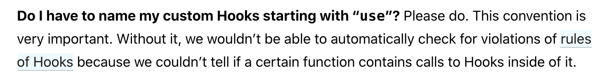

## What are custom hooks?

A custom hook allows you to extract some components logic into a reusable function.

A custom hook is a Javascript function that starts with _use_ and that call can other hooks. Remember that components and hooks are functions, so we are really not creating any new concepts here. We are just refactoring our code into another function to make it reusable.

### Without a custom hook

Let's imagine that we have a functionality in our component to retrieve the window's width. We want to know when the user resizes the screen. To change our design, we want to know when the screen is small for example. We could write something like this:

```javascript
const LayoutComponent = () => {
  const [onSmallScreen, setOnSmallScreen] = useState(false);

  useEffect(() => {
    checkScreenSize();
    window.addEventListener("resize", checkScreenSize);
  }, []);

  let checkScreenSize = () => {
    setOnSmallScreen(window.innerWidth < 768);
  };

  return (
    <div className={`${onSmallScreen ? "small" : "large"}`}>
      <h1>Hello World!</h1>
    </div>
  );
};
```

We have a component here that has _onSmallScreen_ state that knows if we are on a window with a width smaller than 768 pixels. To know that, we use a _useEffect_ hook. Inside that hook, we first call the _checkScreenSize_ function that updates the _onSmallScreen_ state variable. Finally, we bind that _checkScreenSize_ function to a resize event listener to update the state, if necessary, when the resize event occurs.

## Creating the custom hook

This works just fine. As soon as the width of the window gets below 600 pixels, the class name is changed to _small_, and over 600 pixels, it goes back to _large_.

Now, imagine I want to use this functionality, controlling the width of the window, in other places in my application. Should I just copy and paste this code? We could, but we can extract this functionality inside a custom hook, and reuse it anywhere we want.

Because hooks are just Javascript functions, they don't need a React component to actually exist.

I'll create a new file called _useWindowWidth.js_:

```javascript
import { useState, useEffect } from "react";

const useWindowsWidth = () => {
  const [isScreenSmall, setIsScreenSmall] = useState(false);

  let checkScreenSize = () => {
    setIsScreenSmall(window.innerWidth < 600);
  };
  useEffect(() => {
    checkScreenSize();
    window.addEventListener("resize", checkScreenSize);

    return () => window.removeEventListener("resize", checkScreenSize);
  }, []);

  return isScreenSmall;
};

export default useWindowsWidth;
```

We extracted this functionality inside this _useWindowWidth_ function. Now, we can import it anywhere we want to use it!

```javascript
import React from 'react'
import useWindowWidth from './useWindowWidth.js'

const MyComponent = () => {
  const onSmallScreen = useWindowWidth();

  return (
    // Return some elements
  )
}

```

Isn't that cool? I've had one of those functionalities in one of my project. I needed to know the size of the window in order to adapt the elements I was rendering. Using a custom hook reduced the amount of duplicate code.

Of course, anything you'd use inside a hook within a component can be extracted and used onside your custom hooks.

For example, let's imagine you have components that display a list of comments based on an article. We could imagine something among those lines:

```javascript

const ArticleWithComments = (articleId) => {
  const [comments, setComments] = useState([])
  const [error, setError] = useState(null)

  let handleCommentsSuccessFetch = (articleComments) => setComments(articleComments)

  let handleError = error => setError(error)

  useEffect(() => {
    fetchComments(articleId, handleCommentsSuccessFetch, handleError)
  }, [])

  return (
    // Do something in the DOM
  )
}

const BlogPostWithComments = (blogPostId) => {
  const [comments, setComments] = useState([])
  const [error, setError] = useState(null)

  let handleCommentsSuccessFetch = (blogPostComments) => setComments(blogPostComments)

  let handleError = error => setError(error)

  useEffect(() => {
    fetchComments(blogPostId, handleCommentsSuccessFetch, handleError)
  }, [])

  return (
    // Do something in the DOM
  )
}

```

In this example, we have two components. Both of them fetch a list of comments based on an ID, either an article's id or a blog post's id. In the _useEffect_ hook, we have an API call that retrieves those comments with two functions. One in case of success sets the comments in the state, the second in case of an error sets the error in the state.

But, the functionality is duplicated between those two components. Fortunately, we can extract this functionality inside a custom hook:

```javascript
const useCommentsRetriever = (entityId) => {
  const [comments, setComments] = useState([]);
  const [error, setError] = useState(null);

  let handleCommentsSuccessFetch = (comments) => setComments(comments);

  let handleError = (error) => setError(error);

  useEffect(() => {
    fetchComments(entityId, handleCommentsSuccessFetch, handleError);
  }, []);

  return [comments, error];
};
```

Here, we have our hook _useCommentsRetriever_. It takes an _entityId_ as an argument. This will be our article's id or blog post's id. Then, it's similar to what we had in the components. The difference is that this custom hook needs to return something. I chose to return an array here. The first element will be the comments, the second will be the error.

And it would be used in this way:

```javascript
//Import the custom hook
import useCommentsRetriever from './useCommentsRetriever.js'

const ArticleWithComments = (articleId) => {

  const [comments, error] = useCommentsRetriever(articleId)

  return (
    // Do something in the DOM
  )
}

const BlogPostWithComments = (blogPostId) => {

  const [comments, error] = useCommentsRetriever(blogPostId)

  return (
    // Do something in the DOM
  )
}
```

See how much less code we need to write? The _useCommentsRetriever_ takes an id as a parameter. The `[comments, error]` is what we call _array destructuring_. The hook _useCommentsRetriever_ returns an array. We assign the first item of that array to a variable name comments, the second of that array to a variable name error.

Note that I could have named those variables any way I wanted. I could have named them differently in the two components as well. So, when you see the same syntax used in the _useState_ hook, this is because the _useState_ hook also returns an array :wink:

I have an article on the state hook if you want to know more.

### Do we have to start our custom hooks with use?

According to the React docs, yes.



You can check the [rules of hooks](https://reactjs.org/docs/hooks-rules.html) in the documentation for further information.

### Isolation of custom hooks

If you use the same custom hooks in two components, they will **not** share state. The state in our BlogPostWithComments will be completely separated from the state of our ArticleWithComments. Each custom hook create a new function that is using _useState_ and _useEffect_ from React. We can use several hook inside the same component, the same logic applies here.

## Sky's the limit

Custom hooks allows you to really use your imagination when writing your React code. You can extract and share logic in a way that was not possible with class components.

Have fun :heart:
