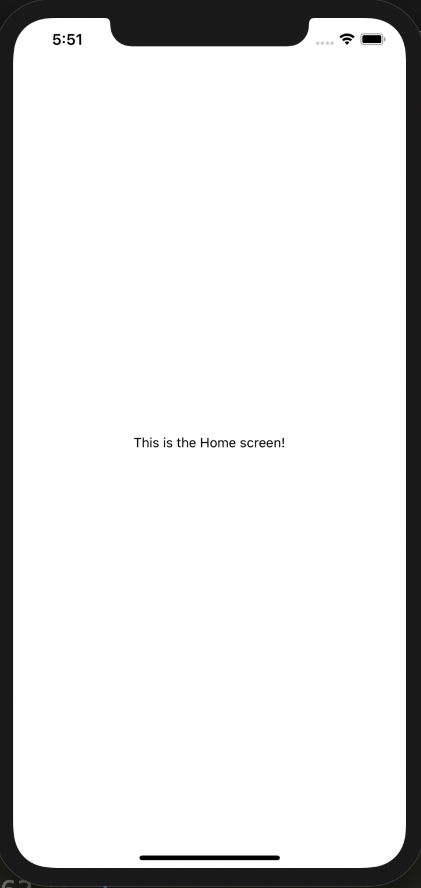
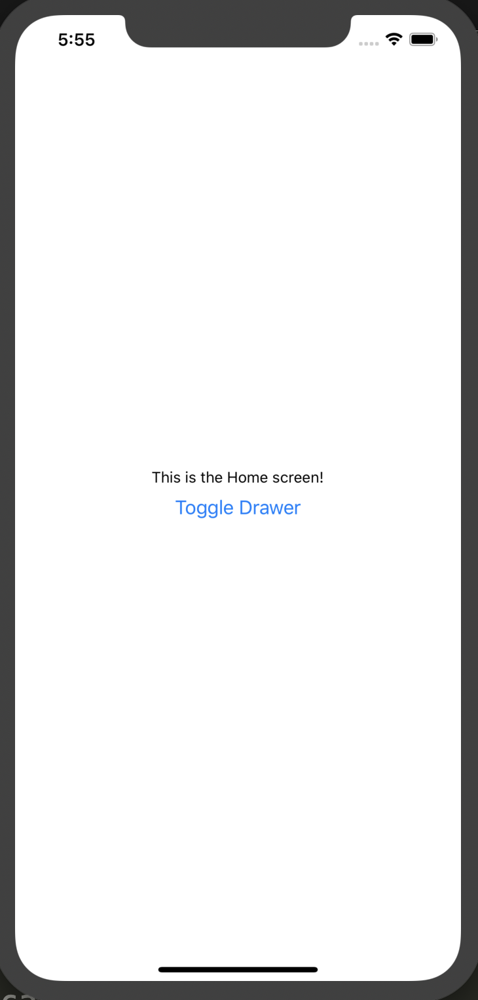
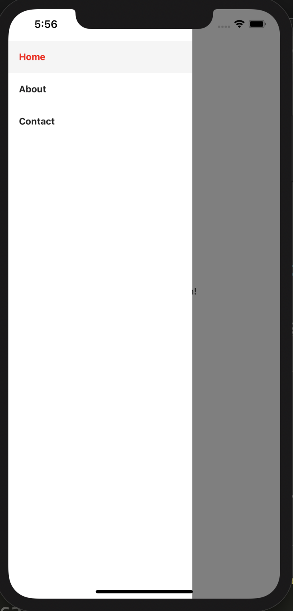
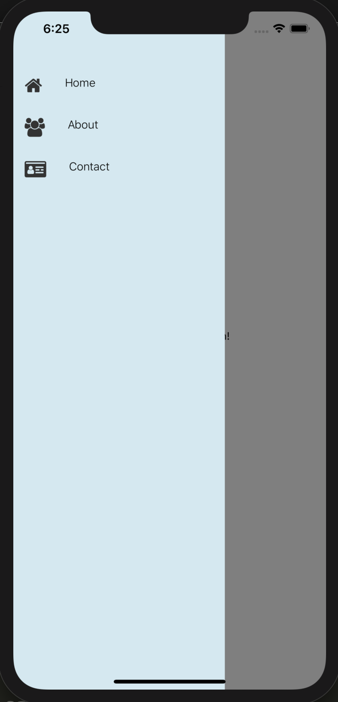

## Introduction

React Native is a library created by Facebook that allows you to write cross-platforms mobile application. Instead of writing separate code from Android and iOS applications, you can write your code in React Native. In this article, I'll show you how to use react-navigation to use a drawer to navigate inside your application.

## Setup

I'll assume that you already have React Native installed. If you don't, please refer to <a href="https://facebook.github.io/react-native/docs/getting-started">this page.</a> I personally use the Expo CLI as my development environment.

Create a new project. if you are using expo: run `expo init <NAME_OF_YOUR_APP>`.

To use a drawer navigation, you'll need to install to following packages:

`yarn add react-navigation react-navigation-drawer react-native-reanimated react-native-gesture-handler react-native-safe-area-context`

## Creating our pages

Great, now we can get coding. First, let's creating the screens we will need. I will create three simple screens, Home, About and Contact. In the root of your project, let's create a folder called _screens_. Inside the _screens_ folder, add the following files:

- Home.js

```jsx
import React from "react";
import { View, Text, StyleSheet } from "react-native";

const Home = () => {
  return (
    <View style={styles.container}>
      <Text>This is the Home screen!</Text>
    </View>
  );
};
const styles = StyleSheet.create({
  container: {
    flex: 1,
    alignItems: "center",
    justifyContent: "center"
  }
});
export default Home;
```

- About.js

```jsx
import React from "react";
import { View, Text, StyleSheet } from "react-native";

const About = () => {
  return (
    <View style={styles.container}>
      <Text>This is the About screen!</Text>
    </View>
  );
};
const styles = StyleSheet.create({
  container: {
    flex: 1,
    alignItems: "center",
    justifyContent: "center"
  }
});
export default About;
```

- Contact.js

```jsx
import React from "react";
import { View, Text, StyleSheet } from "react-native";

const Contact = () => {
  return (
    <View style={styles.container}>
      <Text>This is the Contact screen!</Text>
    </View>
  );
};

const styles = StyleSheet.create({
  container: {
    flex: 1,
    alignItems: "center",
    justifyContent: "center"
  }
});
export default Contact;
```

Great! Now, we'll need to connect all of those pages into a navigator.

## Creating a navigator

In the root of your project, there is an _App.js_ file. First, we need to import our 3 screens. We also need to import a few things from the packages we installed earlier. Add these lines at the top:

```js
import Home from "./screens/Home";
import About from "./screens/About";
import Contact from "./screens/Contact";
import { createAppContainer, createSwitchNavigator } from "react-navigation";
import { createDrawerNavigator } from "react-navigation-drawer";
```

### The drawer navigator component

We will need to create a Drawer navigation component with the _createDrawerNavigator_. The function takes two parameters: the routes configuration and the drawer navigation configuration.
Still inside the _App.js_ file:

```jsx
const DrawerNavigation = createDrawerNavigator(
  {
    HomeScreen: Home,
    AboutScreen: About,
    ContactScreen: Contact
  },
  {
    initialRouteName: "HomeScreen",
    contentOptions: {
      activeTintColor: "red"
    }
  }
);
```

The _initialRouteName_ option will tell our application which screen to load first. I'll also use the _contentOptions_ and _activeTintColor_ to set the color of the active screen's link to red. You can find more available options <a href="https://reactnavigation.org/docs/en/drawer-navigator.html">here</a>.

Next, we need to insert that DrawerNavigator inside a createSwitchNavigator. This is _NOT_ mandatory, but if you want to add another navigator to handle authentication screens, it's better this way.

Anyway, after all that our entire _App.js_ file will look like this:

```js
import React from "react";
import { StyleSheet, Text, View } from "react-native";
import Home from "./screens/Home";
import About from "./screens/About";
import Contact from "./screens/Contact";
import { createAppContainer, createSwitchNavigator } from "react-navigation";
import { createDrawerNavigator } from "react-navigation-drawer";

const DrawerNavigation = createDrawerNavigator(
  {
    Home: Home,
    About: About,
    Contact: Contact
  },
  {
    initialRouteName: "Home",
    contentOptions: {
      activeTintColor: "red"
    }
  }
);

const Router = createAppContainer(
  createSwitchNavigator({
    // This is where your Auth screens would be handled.
    DrawerNavigation
  })
);

export default function App() {
  return <Router />;
}
```

Great, now everything is setup. But one question remains: how do we access the drawer? Well, the code we just wrote will give our Home, About and Contact components access to a prop called _navigation_, courtesy of the _createAppContainer_ in the _App.js_. This prop will allow us to handle the drawer, and navigate in our application.


_Our home screen_

### Using the drawer in our screens

Usually, you would have a Header component to open/close the drawer. Here, I'll juste create a button on my screens. Obviously, in your application, you'll want to have something nice and pretty ;)

For example, in our _Home.js_:

- Home.js

```js
import React from "react";
import { View, Text, StyleSheet, Button } from "react-native";

const Home = ({ navigation }) => {
  return (
    <View style={styles.container}>
      <Text>This is the Home screen!</Text>
      <Button onPress={() => navigation.toggleDrawer()} title="Toggle Drawer" />
    </View>
  );
};
const styles = StyleSheet.create({
  container: {
    flex: 1,
    alignItems: "center",
    justifyContent: "center"
  }
});
export default Home;
```

Here, we add the _navigation_ prop provided by the Router. This prop, among other things, will give us three fonctions: _toggleDrawer_, _openDrawer_ and _closeDrawer_. So, I'll add a button to toggle our drawer.


_Home screen with the toggle button_

it works! Notice how the Home link is in red, because we added the _activeTintColor_ options when we create our DrawerNavigation.


_Our drawer is open and functional_

And that's pretty much it, you can now navigate between your screens! Congratulations!

## Make it prettier ( or not... )

Our drawer works, but it looks a bit sad. Let's use some of the options available to make it a little bit more attractive. We can provide a content component option to our _createDrawerNavigator_ function to customize how it looks. First, we will add a pacakge in order to use some nice looking icons:

`yarn add react-native-vector-icons`

Now, in _App.js_, we will modify our variable DrawerNavigation like so:

```js
const DrawerNavigation = createDrawerNavigator(
  {
    Home: Home,
    About: About,
    Contact: Contact
  },
  {
    initialRouteName: "Home",
    drawerBackgroundColor: "lightblue",
    contentOptions: {
      activeTintColor: "red"
    },
    contentComponent: DrawerMenu
  }
);
```

Ok, so now our Drawer will use a custom component call _DrawerMenu_. Let's create this component:

```js
import React, { Component } from "react";
import {
  StyleSheet,
  Text,
  TouchableOpacity,
  View,
  FlatList
} from "react-native";

import Icon from "react-native-vector-icons/FontAwesome";

const menuData = [
  { icon: "home", name: "Home", screenName: "Home", key: 1 },
  { icon: "users", name: "About", screenName: "About", key: 2 },
  {
    icon: "id-card",
    name: "Contact",
    screenName: "Contact",
    key: 3
  }
];

class DrawerMenu extends Component {
  render() {
    return (
      <View style={styles.container}>
        <FlatList
          data={menuData}
          renderItem={({ item }) => (
            <DrawerItem
              navigation={this.props.navigation}
              screenName={item.screenName}
              icon={item.icon}
              name={item.name}
              key={item.key}
            />
          )}
        />
      </View>
    );
  }
}

const DrawerItem = ({ navigation, icon, name, screenName }) => (
  <TouchableOpacity
    style={styles.menuItem}
    onPress={() =>
      navigation.navigate(`${screenName}`, { isStatusBarHidden: false })
    }
  >
    <Icon name={icon} size={25} color="#333" style={{ margin: 15 }} />
    <Text style={styles.menuItemText}>{name}</Text>
  </TouchableOpacity>
);

const styles = StyleSheet.create({
  container: {
    flex: 1,
    backgroundColor: "rgba(255,255,255,0.43)",
    paddingTop: 70
  },
  menuItem: {
    flexDirection: "row"
  },
  menuItemText: {
    fontSize: 15,
    fontWeight: "300",
    margin: 15
  },
  menuItem: {
    flexDirection: "row"
  },
  menuItemText: {
    fontSize: 15,
    fontWeight: "300",
    margin: 15
  }
});

export default DrawerMenu;
```

There is nothing extraordinary here. The _FlatList_ component is given the information about our tabs, such as the screen names, icons and labels.
Don't forget to import the DrawerMenu component in your _App.js_!


_Our customized drawer_

It does look better, right?

## Conclusion

Well, there you have it. You successfully implemented a Drawer navigation in your application. As you can see, you can customize your drawer as you wish to make it look just the way you want it!

Have fun <3 !
