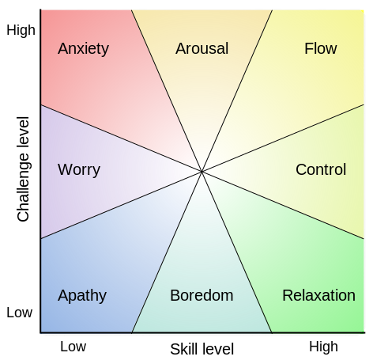

# Introduction

The pursuit of happiness has been a human issue for quite some time. We look for ways to be happy, find our purpose and feel like what we do matter, and make a difference. One of the ways we believed we could be happy and happier was by accumulating wealth. If I had more money and more stuff, we thought, I could finally be happy. Studies shows that, after the basic needs are covered ( food, shelter, clothing...), more wealth doesn't correlate with an increase of happiness.

So, if that path doesn't lead to us being happier, what could help? Well, I believe a lot of things could help, but, in this article, I'll try to explain the concept named as _flow_.

# How flow came to be

The _old_ economy was mostly based on routine tasks. This sort of society mainly looks for one thing in particular from employees: compliance. It's the good old carrots and sticks, rewards and punishments.

Now, a lot of employees are asked to solve complex problems that require creativity. This sort of rewards/punishments system is actually catastrophic for creative work. This new economy doesn't support compliance, but engagement. Engagement can produce mastery. As a time where a lot of people don't feel engaged and happy at work, this is a big issue.

Csikszentmihalyi, an Hungarian psychologist, started by studying creative people and how they felt during their happiest moments. This lead him to study the field of play and he discovered that during those play moments, many would enjoy _autotelic_ experiences (_auto_ self and _telos_ goal in greek). That meant the activity was its own reward. The rewards were intrinsic, proper to the individual itself and not governed by outside forces.

Csikszentmihalyi then asked some volunteers to wear an electronic device that would alert them at random moments during the day. The participants were asked to note what they were doing at this moment, who they were with and how the would describe their state of mind. This experience provided him with a library of human experiences. From that, it was easy to distinguish at what time people felt happiest. He figured out those moments happened when the person was having an autotelic experience, a word he then replace by one used by many people to describe their experiences at the time: _flow_.

## How to achieve flow

So, flow is a state where we are completely in the moment, concentrated on a task that is using our full potential. Emotions and experiences are in sync with the task at hand. We lose track of time and space where we make one with the activity. With what kind of tasks can we achieve flow?

### Flow and Clear goals

Good news is, most of them. In flow, goals are clear. You need to score a goal, hit the right notes, swim as fast as possible, solve a complex code problem... Which means, the feedback is immediate. You know if you achieve the goal or not rather quickly. You can adjust your behavior based on the feedback, and not lose sight of your goal.

### Flow and the right type of tasks

The task is in what Csikszentmihalyi (pronounced chick-sent-me-high) calls the _Goldlilocks tasks_. Those tasks are not too complicated, not too easy. It's in the sweet spot. Too easy and it becomes routine, too hard and we are just guessing and getting frustrated. The relationship between what a person has to do and what she could do is perfect. This creates a degree of focus and satisfaction.

Flow can also be achieved by turning work into play. Even jobs where autonomy and creativity or getting a _play mode_ seems impossible, there are always some small ways you can add some flow and achieve mastery.

### Flow and intrinsic motivation

Flow is enabled when we focus on intrinsic rewards. That means, we are motivated by things from within ourselves, which we have full control over. An intrinsic reward might be to learn something new, to be proud about your work or to keep a degree of autonomy. An extrinsic reward, on the other hand, is controlled or given by other people. The pay, the recognition from your colleagues or a promotion.

Extrinsic motivation is dangerous and leads to dissatisfaction. Power, wealth and fame are no guarantee to a happy and fulfilled life.

## Conclusion

Flow is a crucial part of achieving mastery in any field. To become better, you have to create/request an environment that will allow you to reach a state of flow. Looking for flow is hard work, but you will find an immense potential for growth!

Have fun!
