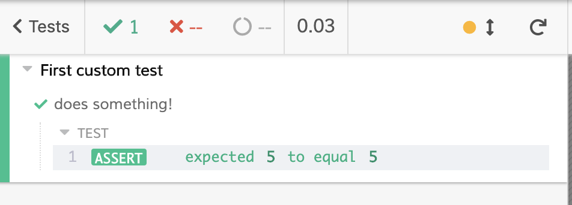
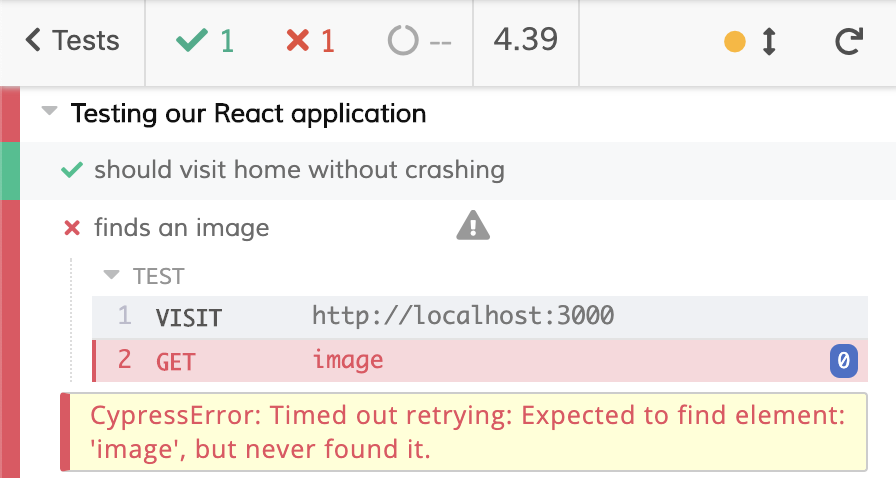

## What is Cypress?

Cypress is a front-end testing tool. Cypress allows you to test anything thaty runs in a browser. With Cypress, you can write unit tests, integration tests and end-to-end tests. Cypress architecture allows you to have complete control over your application.

Cypress aims to help you write faster, easier and more reliable tests. Instead of having to choose a bunch of different frameworks, assertion libraries and other tools to get started, Cypress made those choices for you and lets you write tests right away. Cypress also works for any framework or website. React, Vue, Ember, Vue, Elm... Cypress uses tools you most likely already know such as JQuery, Mocha, Chai and sinon.js... Stable tools that proved their worth, all bundled together into Cypress.

Now that we talk a bit about what it is, let's use it!

## System requirements

Cypress uses a desktop application installed on your computer. To use it, you must have the following operating systems:

- macOS 10.9 and above (64-bit only)
- Linux Ubuntu 12.04 and above, Fedora 21 and Debian 8 (64-bit only)
- Windows 7 and above

## Installing Cypress

In this article, we will write our tests on a React application. So, before anything else, we'll create a React application with _create-react-app_. LEt's run the following command: `create-react-app first-cypress-tests`.

If you do not have create-react-app installed, you can find instructions to get it [https://github.com/facebook/create-react-app](here). Once your application is set up, move inside your new React application folder: `cd first-cypress-tests`. Next, we'll install the Cypress package. I'll use yarn for this article and run `yarn add cypress --dev`. If you are a npm user, you can run `npm install cypress --save-dev`.

Now that Cypress has been installed, we can run the Cypress Test Runner with the command `yarn run cypress open`. Or, with npm, you can run `$(npm bin)/cypress open`. You should the following window on your screen now.


You'll see that Cypress created a folder for you. In there you will find some useful examples on how to write tests and some examples of what you can do with Cypress. The examples tests will be in `cypress/integration/examples`.

## Running your first test

After clicking the **OK, got it!** green button, you'll see the Cypress Test Runner.


There are a few things we can see here. First, you can see all the test files listed in the window. Cypress will automatically find your test files inside the `cypress/integration` folder. Notice how each file ends with _spec.js_. I'll keep this naming throughout the article but you don't have to. On the right, you have a little dropdown.


This is a list of available browsers found by the Cypress Test Runner. When Cypress runs the tests, it launches a browser for you. As you can see, I only have two choices available. If you want to know what browsers can be used, and how to add them, you can read [https://docs.cypress.io/guides/guides/launching-browsers.html#Browsers](the docs). I'll stick with Chrome for now.

Alright, let's run some tests! There are two ways you can do that. You can click the **Run all specs** button on the right, or click on a file name. If you do the latter, only this file's tests will run. When the tests start running, you will a browser open, depending on which one you chose in the Cypress Test Runner. We will have to time to come back to that in detail later, because I want to write my own custom tests now.

## Writing your first test

You might have guessed what it takes to run a test in Cypress:

- Create a test file in `cypress/integration`
- Let Cypress update the list of test files in the Cypress Test Runner in real time
- Launch the test

Let's create a folder called `custom` inside our `cypress/integration` folder. I'll then create a file called `first_tests.spec.js` inside that new folder. If you move back to the Cypress Test Runner, you'll see that our folder and our file have been added to the list! Real Time!!


Great, now let's write our first passing test.

```js
describe("First custom test", function() {
  it("does something!", function() {
    expect(5).to.equal(5);
  });
});
```

Very simple for now. Go back to the Cypress Test Runner and click on our file name to launch our new test. You'll see a browser window getting opened (Chrome for me), and our test successfully run!



You have unlocked the _Write a passing test in Cypress!_ badge. Good job, young TDD padawan. Let's now write a failing test and see the real time reloading in action.

`youtube: https://youtu.be/ym5yKAq11SE`

We start by writing a failing test, which we can see in red in the browser. Cypress watches test test files changes and updates the test suites results accordingly. Pretty sweet!

The syntax of the tests might be familiar to you. _describe()_ comes from _mocha_ for example, and _expect()_ comes from _chai_. As I mentioned earlier, they are part of the tools that come baked in with Cypress.

Ok, let's write some real tests, things we might actually use in real life. We create a React application earlier. We don't have much, but the skeleton we have will let us write a few things.

## Visiting our application page

My React application will be serve on port 3000. The first thing we can test is making sure it doesn't crash when I visit _http://localhost:3000_. Let's create a file called `react_app.spec.js` inside `cypress/integration/custom` to hold our tests. We'll also need to run our app. Run `yarn start` or `npm start` to launch our React application. You should see this when you visit _http://localhost:3000_:


Let's write our test and see the Test Runner handle it:

`youtube: https://youtu.be/Wv78Rogxkls`

A few things happen:

- You will see a **VISIT** log on the left side.
- On the rght side, our React application is being loaded in the App preview.
- The test is green, even if there was no assertions. If the request had come back with a 404 or 500 status code, the test would have failed.
- The **VISIT** test has a blue background while the page is loading. This indicates a pending state.

_Note:_ Make sure you test applications you control. Don't test websites you don't control. They may change at any moment, or some security features have been enabled that will prevent Cypress from functioning properly.

## Checking for an element existence

I've launched the React application created from a `create-react-app` command. From this, I know two things about the state of the HTML in our application: there should be an image and a link on the home page.

For the image, I want to test two things:

- The image has the class _App-logo_
- The image has the alt attribute _logo_

First, let's write a failing test.

```js
it("finds an image", function() {
  cy.visit("http://localhost:3000");
  cy.get("image");
});
```

This fails, but notice the time it took to go red.



More than **4 seconds**! 4.39 in my case. That is because Cypress will automatically wait and rerun the test. Cypress expects to find the element at some point in the DOM. So, it won't fail right away.

Before anything else, let's change this to make our test pass:

```js
it("finds an image", function() {
  cy.visit("http://localhost:3000");
  cy.get("img");
});
```

And sure enough, it goes green:


Great, at least we can be sure there is an  element on our page. Next, we'll test if the class name _App-logo_ is used by an image. Here is how you would do it:

```js
it("finds an image", function() {
  cy.visit("http://localhost:3000");
  cy.get("img").should("have.class", "App-logo");
});
```

And that is a passing test!


Finally, we want to make sure that the image has an attribute that is equal to _logo_. Because _cy.get()_ returns a jQuery object, we can use the _invoke()_ method to get any attribute we want.

```js
it("finds an image", function() {
  cy.visit("http://localhost:3000");
  cy.get("img")
    .should("have.class", "App-logo")
    .invoke("attr", "alt")
    .should("equal", "logo");
});
```

Now, run the test, and that is still green.

### DOM snapshot

I also want to show you how you can _pin_ a DOM snapshot to get informations in the console. Open the developer console inside the browser Cypress opened for you. Then, click on the **INVOKE** line in the logs on the left. You should see a grey pin turn purple. And see what's happening in the console? How great is that to have all those informations? It makes debugging your tests so much easier.


_Note:_ We could go further with our last test by making sure we only have one image in the DOM with those attributes, or check the src attribute. I'll leave that to you :wink:

## Clicking an element

We also know that our React application has a link. With Cypress, we can interact with that element and make sure it takes us where it claims to. First off, I'll change the `<a>` element markup in our HTML to make it easier to test. That's how it should be:

```jsx
<a className="App-link" href="/about" rel="noopener noreferrer">
  Learn React
</a>
```

I've changed the href attribute to make sure it stays inside the application, where I have full control of what happens. Let's write a test to get our `<a>` element:

```js
it("clicks a link", function() {
  cy.visit("http://localhost:3000");
  cy.get("a.App-link")
    .invoke("attr", "href")
    .should("equal", "/about");
});
```


I've looked for an `<a>` element with the class _App-link_ and the href attribute _/about_. Ok, now we can call the click method on our element. We will then check that the new url is the one we expect.

```js
it("clicks a link", function() {
  cy.visit("http://localhost:3000");
  cy.get("a.App-link")
    .should($link => {
      expect($link)
        .attr("href")
        .to.equal("/about");
    })
    .click();
  cy.url().should("contain", "/about");
});
```

This test might look a bit more complicated. Let's break it down.

- First, we get our element.
- Then, we use the _should()_ method. This method takes a callback with the result of the previous _get()_.
- Outside that callback, chained to the _should()_ is our _click()_ method.

Why use the callback? Well, the _click()_ method interacts with the results of the last result. So, if we chained the method to an _invoke().should()_ method like we used before, we would have an error because the result of that chaining is not a DOM element. That is why we have to do our href attribute test _outside_ the usual chaining.

Finally, after all that, we check if the url contains the string _/about_ by using the _cy.url()_ function.

`youtube: https://youtu.be/iTLrfk4LPFw`

As you can see, the preview updates the url based on the _click()_ event. The logs show us all the different steps: **CLICK**, **PAGE LOAD**, **NEW URL**.

## Conclusion

I hope this first article showed you the power Cypress brings to the table. We've seen how to:

- Install Cypress
- Run the Cypress Test Runner
- Test a React application

I really found that Cypress facilitates writing tests for the front-end, something I've always been struggling with. Using tools that a lot of developers already know, Cypress is easy to begin with, and there are a lot of other cool things I'll show you in the future.

Have fun :heart:
