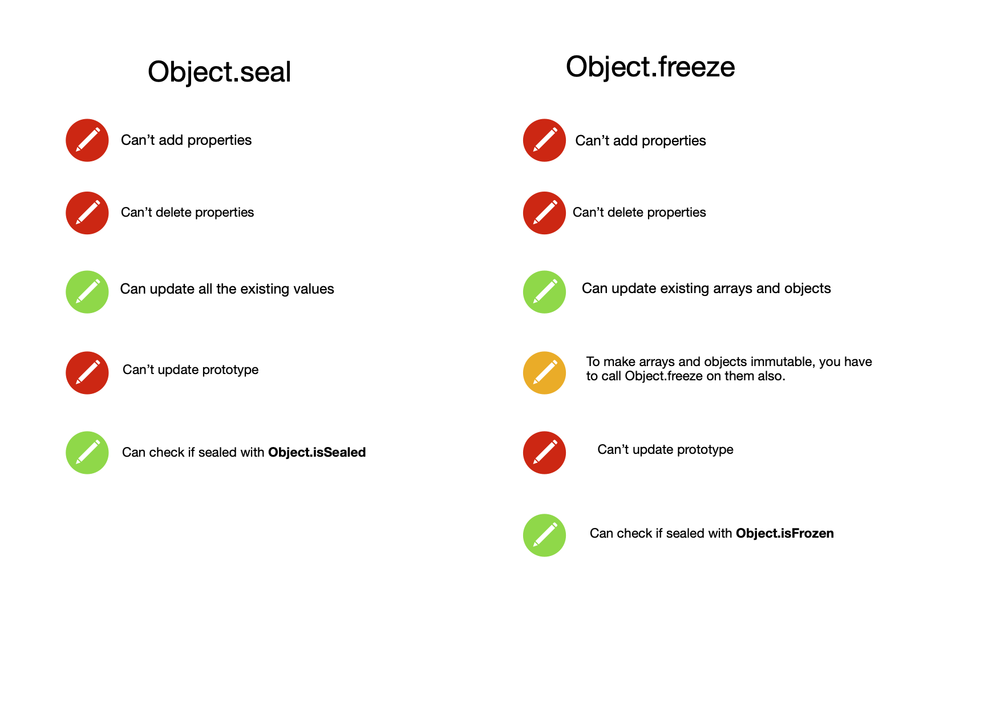

## Object.freeze

Here is how you use _Object.freeze_:

```javascript
let objectToFreeze = {
  age: 28,
  name: "Damien",
  pets: ["Symba", "Hades", "Kiwi"],
  sibling: {
    age: 25,
    name: "Corentin",
  },
};

Object.freeze(objectToFreeze);
```

_Object.freeze_ takes an object as an argument. Note that it modifies the object you pass as argument. It does not copy the object and create a new one.

So what does it mean for the object?

- You can't add new properties to the object
- You can't modify the properties if they are not objects or arrays themselves. (More on this later)
- You can't delete properties from the object

```javascript
let objectToFreeze = {
  age: 28,
  name: "Damien",
  pets: ["Symba", "Hades", "Kiwi"],
  sibling: {
    age: 25,
    name: "Corentin",
  },
};

Object.freeze(objectToFreeze);

delete objectToFreeze.age;
objectToFreeze.name = "Ben";
objectToFreeze.pets.push("Grenade");
objectToFreeze.sibling.age = 26;
objectToFreeze.lastName = "Cosset";
```

With the description I just gave you, you should guess what the object will look like now:

```javascript
console.log(objectToFreeze)

// objectToFreeze :
{ age: 28,
  name: 'Damien',
  pets: [ 'Symba', 'Hades', 'Kiwi', 'Grenade' ],
  sibling: {
    age: 26,
    name: 'Corentin'
  }
}
```

The _delete_ failed, modifying the _name_ property failed and adding the _lastName_ property failed. But modifying the array and the nested sibling object worked.

_Note: If you are not in strict mode, it will fail silently. In strict mode, you will get TypeErrors_

```javascript
"use strict";

let objectToFreeze = {
  age: 28,
  name: "Damien",
  pets: ["Symba", "Hades", "Kiwi"],
  sibling: {
    age: 25,
    name: "Corentin",
  },
};

Object.freeze(objectToFreeze);

delete objectToFreeze.age;
```

Throws this:


### Shallow freeze

What we have when we call _Object.freeze_ is a **shallow freeze**. We only freeze what is directly attached to the object. Properties inside objects and arrays are not concerned.

To make the entire object and everything inside immutable, you have to call _Object.freeze()_ on every element. Here is one way you could do this:

```javascript
let allYouCanFreeze = () => {
  // Retrieve the properties names
  let propNames = Object.getOwnPropertyNames(obj);

  // Loop through the properties
  // If typeof is "object", meaning an array or object, use recursion to freeze its contents.
  for (let name of propNames) {
    let value = obj[name];
    obj[name] =
      value && typeof value === "object" ? allYouCanFreeze(value) : value;
  }

  // Finally, freeze the main object
  return Object.freeze(obj);
};
```

Let's use it on our first object:

```javascript
let objectToFreeze = {
  age: 28,
  name: "Damien",
  pets: ["Symba", "Hades", "Kiwi"],
  sibling: {
    age: 25,
    name: "Corentin",
  },
};

allYouCanFreeze(objectToFreeze);

// Now we can't touch the pets array and the sibling object

objectToFreeze.age = 26; // Now, fails.
objectToFreeze.pets.push("Grenade"); // Now, fails
```

Great! Now, our _sibling_ object and our _pets_ array can't be modified.

#### Object.isFrozen

To know if an object is frozen, you can use _Object.isFrozen()_:

```javascript
Object.isFrozen(objectToFreeze); // === true

let unfrozenObj = { a: 42 };
Object.isFrozen(unfrozenObj); // === false
```

## Object.seal

_Object.seal()_, like the freeze method, takes a object as an argument. _Object.seal_ is a softer version of _Object.freeze_.

- You can't remove or add elements to the object.
- You **can** modify existing properties.

```javascript
let objectToSeal = {
  name: "Damien",
  age: 28,
  pets: ["Symba", "Hades", "Kiwi"],
  sibling: {
    age: 25,
    name: "Corentin",
  },
};

Object.seal(objectToSeal);
```

Pretty straightforward huh? Let's try to modify this object now:

```javascript
delete objectToSeal.name;
objectToSeal.age = 56;
objectToSeal.lastName = "Cosset";
objectToSeal.sibling.age = 45;
objectToSeal.pets.push("Grenade");
```

Maybe you already guessed what should happened :wink:

```javascript
//objectToSeal new contents

{
  name: 'Damien',
  age: 56, //modifying worked
  pets: ['Symba', 'Hades', 'Kiwi', 'Grenade'], // push worked
  sibling: {
    age: 45, // Modifying worked
    name: 'Corentin'
  }
}

// adding and deleting failed!
```

Notice that just like _Object.freeze_, _Object.seal_ will fail silently in non-strict mode and throw a TypeError in strict mode.

#### Object.isSealed

We also have a method to know if an object is sealed. Quite explicit, we can call _Object.isSealed_ to know that:

```javascript
Object.isSealed(objectToSeal); // === true

let notSealedObj = { a: 54 };
Object.isSealed(notSealedObj); // === false
```

## What about const?

You might be tempted to look at _Object.seal_ and _Object.freeze_ and compare them to **const**. Remember that they are different concepts. _Object.freeze_ and _Object.seal_ apply on the **values** of an object, and _const_ applies on the **binding**. _Object.freeze_ makes an object immutable. _const_ creates an immutable binding. Once you assign a value to a variable, you can't assign a new value to that binding.

## What about prototypes?

One last thing I need to mention: prototypes. I've writing an article about Javascript prototypes if you are not familiar with it. When it comes to _Object.freeze_ and _Object.seal_, know that you also can't change their prototypes once they are frozen or sealed.

```javascript
let freezeThat = {
  name: 'Damien'
}

let sealThis = {
  age 28
}

Object.freeze(freezeThat)
Object.seal(sealThis)


// These two lines will fail!
Object.setPrototypeOf(freezeThat, {x: 26})
Object.setPrototypeOf(sealThis, {alive: true})

```

_setPrototypeOf_ is used to change the prototype of an object. When the object is sealed or frozen, you will not be able to do that. As always, in non-strict mode, it will fail silently. In strict mode, you will see a `TypeError: Object is not extensible.`

## Conclusion

It's important to know the differences between _Object.freeze_ and _Object.seal_. Being aware of those differences will avoid you some trouble when you use them in your code.

To recap:


