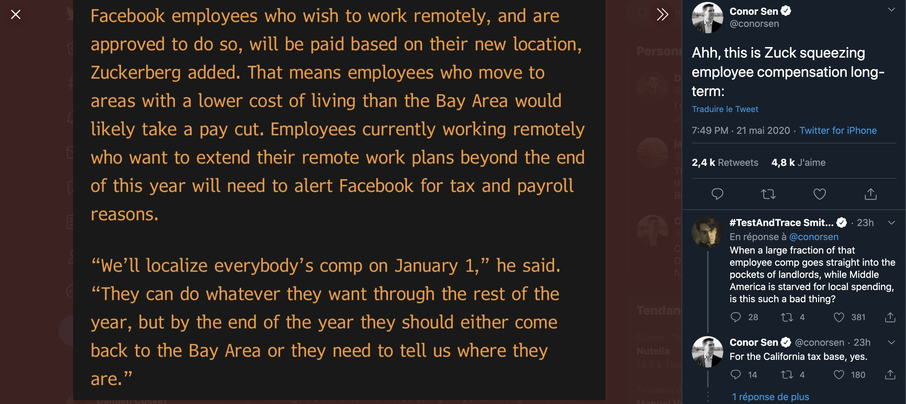

## New World Order

With the COVID-19 crisis, one trend has gained a lot of momentum: remote working. A lot of workers were asking for it for quite some time, pressing their companies to allow them to work from anywhere and trust them that they could be more productive on their own terms.

The coronavirus forced their hands obviously and now some companies decided that remote working was worth it. Twitter announced their teams can keep working from home "forever". Facebook also started the transition towards allowing more of their employees to work remotely.

These two are just some examples of how the crisis _help_ the work from home movement gain traction. Of course, how we do remote work in this crisis is another subject entirely. For hundred of thousands of people, the change was not prepared, or even not wanted. In this configuration, we are trying to make remote work function, during a crisis. But that's another debate.

## What about the salary?

According to this tweet:

 
Our good friend Zucky is basically saying Facebook will not pay employees the same based on their location. There are no details yet of what will be done, and how. But it begs the question:

###### Should remote workers salaries differ based on their location?

Assuming two developers with the same skills, experience and productivity. One lives in New York, the other lives in Marrakech. As a CEO, should you adapt the salary of the developer living in New York, because the cost of living will be much higher than in Morocco?

Basecamp, a company with most of their employees working from home, pays their employees based on same base, which I believe is the New York market. Doesn't matter where they work from. Same experience? Same job? Same pay, period.

If you are a Facebook worker in California, you will be payed higher than a Facebook worker in London. And that disparity will continue after the coronavirus crisis ends and Facebook moves to a remote friendly environment.

What do you think? On one end, if two developers have the same position, they should be able to claim the same compensation for the same work. Should we include the environment they live in in that compensation? A worker in San Francisco is most likely to spend a good amount of his salary to pay a rent. While the developer in Morocco will most likely spend a smaller percentage of his salary towards her housing.

But then, if you start with housing, where do you stop? Should you consider the size of the employee's family? If they still want to work at the office from time to time or full time, should you compensate the salary for the commute costs?

This is a difficult issue, with quite a lot of nuances. Personally, I quite like the "Basecamp" way: pick a _fair_ location and adapt your salaries based on that location.

I'd love to know where you stand on this issue :smile:

Love :heart:

_Sources:_

- [Twitter and Square announces WFH forever option](https://www.forbes.com/sites/danabrownlee/2020/05/18/twitter-square-announce-work-from-home-forever-optionwhat-are-the-risks/#70c683ea2565)
- [Facebook says it will permanently shift tens of thousands of jobs to remote work](https://www.theverge.com/facebook/2020/5/21/21265699/facebook-remote-work-shift-workforce-permanent-covid-19-mark-zuckerberg-interview)
