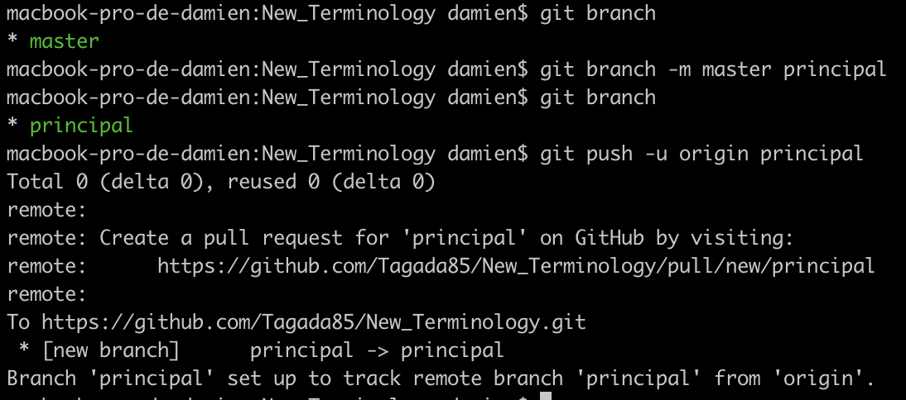
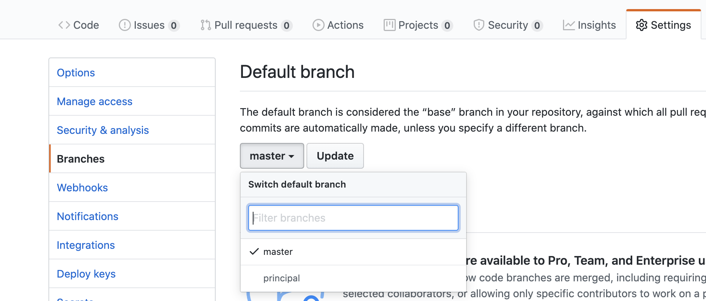
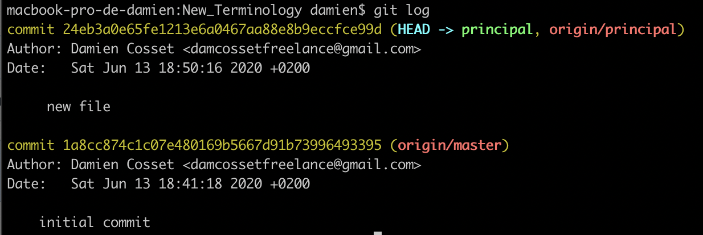

## Master/slave denomination

The master/slave denomination is a common one in technology. Master/slave is an oppressive metaphor referring to the practice of slavery. These metaphors are inappropriate when describing concepts in technology. They are also inaccurate. Using these metaphors takes away the history of slavery and put it into a context where it does not belong.

**Edit**: The git's master is historically tied to the master/slave denomination. [It got the name from BitKeeper](https://mail.gnome.org/archives/desktop-devel-list/2019-May/msg00066.html).

**Edit 2**: [Github is looking to replace the word master](https://www.zdnet.com/article/github-to-replace-master-with-alternative-term-to-avoid-slavery-references/)

Words matter. The words we use to define concepts have a lot of importance, even in our tech environment. Git is one of those environments where the word _master_ is still used. But, it's not that complicated to take it away. We have to do two things:

- Replacing the word on existing branches, both locally and remotely
- Modify your git configuration to not use the word _master_ when running `git init`

Let's start with the first point.

### Replacing master from your existing projects

First off, we have to change our master branch locally.



I have here a project with a master branch. I'm running `git branch -m master principal` to rename my master branch into the _principal_ one. This command keeps the history of the branch, so you won't lose anything!

_Note: I chose to rename the branch as **principal**. You can choose another name if you wish. It has to make sense for you and your team._

Running `git push -u origin principal` updates the remote repository by adding the _principal_ branch. The _-u_ flag also sets the upstream.

##### Change the default branch on Github

Now, I also need to change the _default_ branch on Github. In your repository page, click on the _Settings_ tab, then _branches_ on the left menu. You can update the default branch here:



And you are done! If you run `git log` inside the principal branch, you will see that the history is intact!



We started on _origin/master_ and it properly show that we are on _principal_ now!

##### Updating local clones

What if someone has a local clone of this repository, how would they correctly update their clone?

[This tweet right here](https://twitter.com/xunit/status/1269881005877256192) explain you how. These are the commands you would have to run:

```
$ git checkout master
$ git branch -m master principal
$ git fetch
$ git branch --unset-upstream
$ git branch -u origin/principal
$ git symbolic-ref refs/remotes/origin/HEAD refs/remotes/origin/principal
```

Note that the tweet uses the word _main_ to replace master. Just replace it in the commands with the name you chose.

What these commands do:

- Go to the master branch
- Rename the branch to principal
- Get the latest changes from the server
- _--unset-upstream_ removes the link to _origin/master_
- _-u origin/principal_ creates the link to _principal_
- Updates the default branch

### Git init

When you run `git init`, the default branch is _master_. There are two ways to change that:

##### Using an alias

You can set up an alias that would run `git init` while having a other default branch name:

`git config --global alias.new '!git init && git symbolic-ref HEAD refs/heads/principal'`

Running the above command would allow you to use `git new` and it would have the _principal_ branch as its default.

You can modify this command of course. Notice the `alias.new`, this can be change to `alias.initialization` for example, or whatever command you would like to make. Of course, you can also modify the _principal_ name to fit your needs.

##### Modifying your git config

We can configure our git to change the default branch.

- Find the configuration file of your git. It should be either in `~/.config/git/config` or `~/.gitconfig`.

- Inside this file, add the following lines:

```
[init]
    templateDir = ~/.config/git/template/
```

Now, inside `~/.config/git/template` ( you may have to first run `mkdir ~/.config/git/template` to create it), create a **HEAD** file and add this line, plus a line break.

```
ref: refs/heads/principal

```

When you run `git init`, the whole contents of the _templateDir_ is copied into `.git`.

You can now run `git init` and you will have the branch _principal_ as its default!

Of course, you can change _principal_ to another name if you wish.

### Alternative names

I've chosen to use the word _principal_ to replace master here. Here are other words you can use:

- main
- primary
- leader
- active
- parent

Just don't use master...

Have fun :heart:
Do no harm.

**Sources**

- [The excellent Scott Hanselman blog article](https://www.hanselman.com/blog/EasilyRenameYourGitDefaultBranchFromMasterToMain.aspx)
- [The tweet explaining how to update local clones](https://twitter.com/xunit/status/1269881005877256192)
- [Stack overflow answer for configuring your git]()
