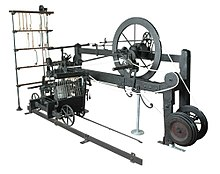
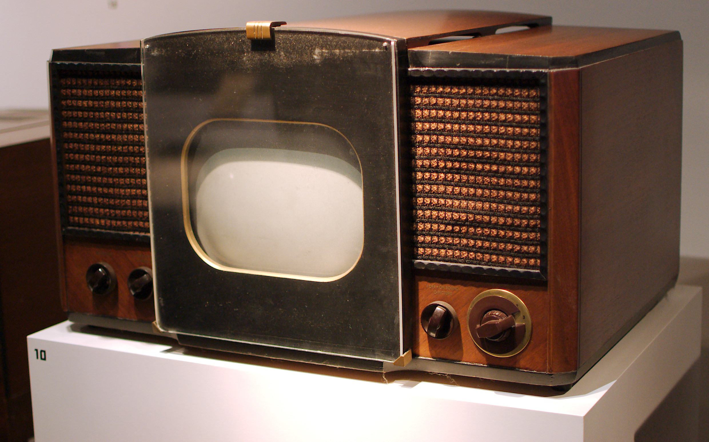

## Every single technology is not neutral

When we are about the neutrality of technology lately, we often hear about some sort of software. We could be talking about facial-recognition, applications like Uber or TikTok or how Google controls a huge part of the market.

But technology is not exclusive to our information era. Technology has been a part of our society for a long time, before computers were here. Are the technologies unrelated to computers and software can claim to be neutral?

I believe no technology can be called neutral.

### Technology's passivity

One of the main argument we hear in favor of the neutrality of technology is that technologies are passive. Because tools do nothing without human intervention, they must be neutral.

That says nothing about a tool's neutrality. Is a firearm neutral because it requires a human to pull the trigger? It is a tool which, by making killing so easy, encourages the act. [People are more likely to commit suicide or violence towards family members if a firearm is in the household](https://www.vox.com/2015/10/1/18000520/gun-risk-death). Accidents involving firearms are also common. By simply existing, technology has non-neutral properties that are independent of social or economic context. Tools are not neutral and their use may contribute to shaping our purposes.

Technology is a reflection of the biases and goals of its creators, and its use can bring about specific ends.

### Technology development is not random

Technology development has often political ends and motives, which gives them non-neutral properties. The physical form of technologies is in many cases an embodiment of political ends, that defeats any purposes of neutrality.

If a society has some needs, whether real or perceived, and given the sufficient financial incentives, developers will get to work on that need pretty quickly.

Take for example the self-acting mule, or automatic spinning machine:

This device was developed during the nineteenth century. The specific purpose was to gain power over skilled spinners. The spinners often went on strikes because they demanded high-pay. To industrialists, they were a real pain to deal with.

This situation provided a need for the development of the self-acting mule, which was quite a challenge for the technologists at the time! Eventually, the device was introduced and changed the balance of power. Now, industrialists had a weapon against the spinners if they ever go on strike. "Go on strike and risk losing your job to the self-acting mule."

From our perspective, the self-mule might only look like a beautiful achievement of technologists at the time. It was! But it was also a lot more than just a clever invention. The development was not neutral. It doesn't matter **how** the device was used. Its very existence created a shift in power.

The history of technology is rich with such examples where political influences act on technology (the electric fridge, printing technology, US Army rifle in Vietnam... )

### Technology has effects regardless on how they are used

Technology has effects. Effects that are not correlated to their socio-economic context. Take the television for example.

A television is a device with non-neutral properties. But those properties are based on **the device itself**, not on the use of the device. Consider what a television allows people to do. A television allows few people to broadcast content to a lot of people. It's inevitable that the wealthy will use it to sell things and the less wealthy won't have access to the medium.

It doesn't matter how the device is used, if it's used by enough people, the same patterns will emerge.

The gun is another obvious example in this category. Another one is the parkways of New York, whose overpasses have a very low clearance, preventing buses from traveling on those roads. This was intended to make the travel of people from poorer sections of societies more difficult, reflecting the attitude of the designer of the system.

Although the difference with the television in this example is that the parkways could easily have been designed differently to allow the passage of buses. The television non-neutral properties are inherent to the device. That's not the case for the parkways. But neither technology is neutral.

If you can associate a technology with some particular patterns and effects, no matter how it is used or how you can control it, then it's not neutral at all.

## Conclusion

Software and computers are a subset of technology. They, too, are non-neutral, and their effects can be a lot more important than the examples in this article. Whenever you choose to use a software, ask yourself who is behind it, why they build it, and what effects it will have on our society.

_Sources:_

[Essay by Laura Nolan](https://www.scss.tcd.ie/tangney/ComputersAndSociety/99/StdPapers/P3-Revisited/ln.html)

[Social Shaping of Technology by Donald Mackenzie and Judy Wajcman](https://www.amazon.fr/Social-Shaping-Technology-Donald-Mackenzie/dp/0335199135)
