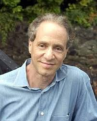

# Introduction

Technology has brought many great things to our society. It also brought us challenges we never faced before. The revolution we are experiencing, the one that started a few decades ago, will shake humanity to its very core.

In 1965, Intel's founder Gordon Moore comes up with what will be later known as _Moore's law_. Moore predicts that integrated circuits power grows exponentially. For the same cost, that power should double every 18 months. That prediction has actually stayed true for more than 60 years. Even Moore himself thought his _law_ would be dead by 1975... Transistors' size has gotten incredibly small, and microprocessors has become incredibly powerful.

If Moore's law is so important, it is because those tools directly affect the calculation capacity of computers. This power opens up a lot of possibilities. Reading our DNA, chromosomes sequencing from extirpated species are only a fraction of what we can envision in the future.

# The transhumanism movement

Over the millenia, Humanity created countless religious systems. They all had one similarity: they had creatures and creators. We are the creatures. Creators are represented as gods or spirits. Humans were seen as inferior. Times are changing.

The crazy technology progress we've seen in the last decades made some fantasies not so insane anymore. The concept of a God-man (Homo-deus, as Yuval Noah Harari would call it) might become a prediction.

Our species _would_ do what only gods were supposed to do. Manipulate and create life, control our genome, program our brains and kill death... IA transforms science-fiction into science.

Life expectancy has more than triple in three centuries. From around 25 years old in 1750 to more than 80 years old today. There is an undeniable biological barrier to what our bodies can handle. Jeanne Calment, the oldest person who ever lived, died at 122 years old. That seems to be a natural limit. Which means that if we want to go above that limit, we must change our biological nature. Nanotechnologies and biology will merge to transform our doctors into life engineers.

Living longer, or forever, will come, if it comes, at the cost of redefining humanity. The fight between transhumanists and bio-conservatives will be a long one. One that bio-conservatives might have already lost.

# Biological or Digital Immortality?

The quest for immortality will bring legitimate oppositions. However, the easy part is over: convincing the public that death isn't inevitable anymore.

In Laurent Alexandre and Jean-François Copé's book, L'IA va-t-elle aussi tuer la démocratie ? (Is AI also going to kill democracy?). The following steps were explained to achieve true biological immortality.

### Calico

Google has created Calico in 2013. I'll let the description on  speak for itself:

> Calico is a research and development company whose mission is to harness advanced technologies to increase our understanding of the biology that controls lifespan. We will use that knowledge to devise interventions that enable people to lead longer and healthier lives. Executing on this mission will require an unprecedented level of interdisciplinary effort and a long-term focus for which funding is already in place.

Their goal is to make humans live longer. A nice way to say they want to make dying something of the past.

### Changing our nature

Going over the limits of our bodies, surpassing the life expectancy our poor, weak anatomy allows suppose to modify profoundly our nature with heavy technological surgeries. We also need to maintain our brains in a _plastic_ state. How good it would be to live forever with a non functional brain.

### Changing the universe

The last part of the biological immortality is to avoid the universe's death. How can we truly be eternal if the universe we live in comes to an end? According to some models from astrophysicists, the cosmos destiny is apocalyptic. Heat death, Big Crunch, Big Freeze... these are some of the scenarios possible. Does humanity's existence have any sense if there are nothing to show for it in the end, when our universe is no more?

For transhumanists, this is a rational goal and the last frontier to insure our immortality. However, biological immortality is still uncertain and far away. The first results from Calico are not expected before 2030. Which, for rich geek billionaires, is too far away. This is why digital immortality is something they also pour their money into.

### Digital immortality

How would digital immortality look?

- Make a digital testament that talks about your life, your values and your life's vision

- Transfer your digital memory and electronic traces to the family in order to understand the psychology of the ancestor.

- Create an AI capable of imagining the deceased's evolution in the futur. So, closing her Facebook or Instagram account is equal to preventing that person's digital immortality. It reduces the possibility to create a digital clone of the deceased. That would be digital euthanasia. And maybe in the near future, that will become as inacceptable as biological euthanasia.

- Create a hologram. Today, it's possible for an AI to re-create a 3D image of anyone.

- Make that hologram a chatbot-hologram. With an AI and the digital remains of the deceased, we could accurately guess how that person would communicate with others.

- Use Elon Musk's inter-cerebral implants.

In 2014, Ray Kuzweil, Google's director of engineering, said:

> In the 2030s, we are going to send nano-robots into the brain (via capillaries) that will provide full immersion virtual reality from within the nervous system and will connect our neocortex to the cloud. Just like how we can wirelessly expand the power of our smartphones 10,000-fold in the cloud today, we’ll be able to expand our neocortex in the cloud.

Basically, Kuzweil predicts we will be able to connect to the Internet with nano-robots implanted in our brains.

In 2016, Elon Musk created Neuralink. The company develops what they call implantable BMI's (brain–machine interfaces). Musk explained that the goal is to achieve _symbiosis with AI_. These implants could also be used to extract real memories from our living brain.

- Last step. Giving up our physical bodies. Become dematerialized intelligences, immortal, merging with other artificial intelligences. The advantages would be huge: we would be immortal, sure, but we could travel at the speed of light, duplicate, merge...

That would be the end of humanity as we know it. This ultimate goal is again predicted, or wished?, by Ray Kuzweil. He is convinced we could transfer our consciousness into microprocessors by 2045, which would allow our mind to survive our biological death. We would become _cyborgs_.

To some transhumanists, the body is an obstacle we will have to tackle one day. They promise us a digital immortality, more virtual than real.

_Ray Kuzweil, the Death Star of the Death._

# What now?

Transhumanism is on its way. It comes with a myriad of promises, but also countless of issues. Big tech companies are behind this movement, throwing big money to _help the human condition_. We know better not to trust those entities with such important matters. This is an issue that needs to be debated in the public space. We can't allow rich white dudes from Silicon Valley develops such technologies without accountability.

In a few years, we will have change our relationships towards death, knowledge, intelligence... But, in our quest for immortality and never-ending progress, we fail to think about the next civilisation we would be creating.

We should be concerned about what AI will bring to the table in the long run. We should also be concerned about who controls that technology. There are a lot of unresolved problems, and that might be a catastrophe if we don't think about them before it's too late.

#### Sources

[L'IA va t-elle aussi tuer la démocratie?](https://www.amazon.fr/LIA-va-t-elle-aussi-tuer-d%C3%A9mocratie/dp/2709664046/ref=sr_1_1?__mk_fr_FR=%C3%85M%C3%85%C5%BD%C3%95%C3%91&keywords=l%27ia+va+t-elle&qid=1572981559&sr=8-1) _in French_
