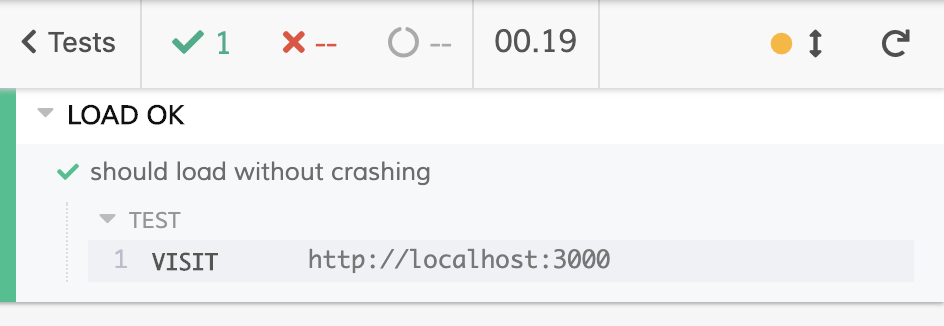
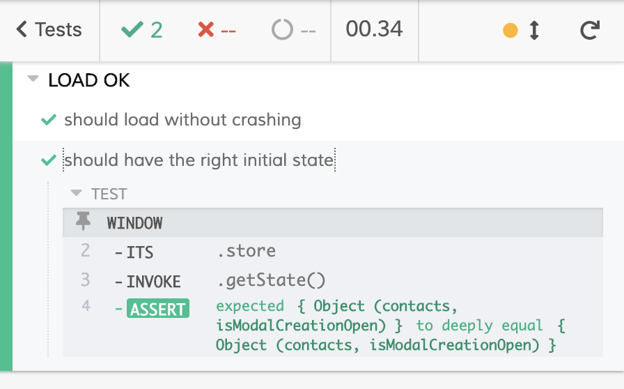
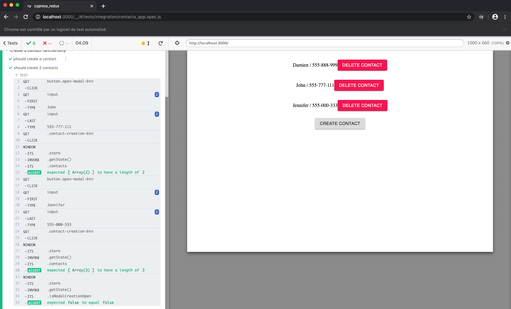
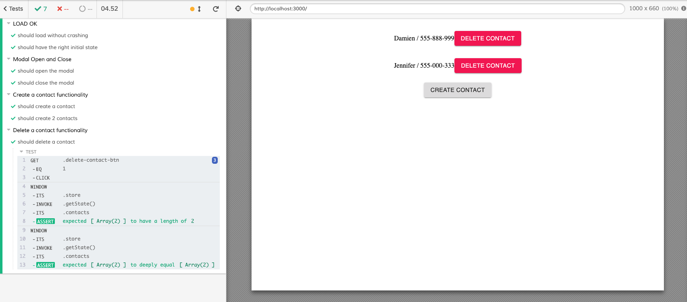

## Introduction

In the [previous article](https://damiencosset.com/posts/getting-started-cypress/), we started to learn how to use Cypress to test our code, with a focus on React. In this article, we'll explore how to use Cypress with data stores, like Redux.

This article assumes that you've read the previous article, in order to install Cypress and launch it with your projects. A basic understanding of Redux is also a nice bonus.

You can find the full code on [Github](https://github.com/Tagada85/cypress_redux).

## The goals

The application we will test is rather straightforward. I can do a few things:

- Open a modal with a form that allows me to add a contact to a list
- Display a list of contacts
- Delete contacts

I use Redux to keep track of my application state. Our objectives will be to test that our store in Redux properly manage our state changes.

`youtube: https://youtu.be/HrI79DKqLsI`

This is what our application looks and works like.

## What to test

Let's write down precisely what we want to test. Our app's state is as follow:

```js
{ contacts: [], isModalCreationOpen: false }
```

- When I click the _Create Contact_ button, I want to make sure the boolean is set to true, indicating that the modal is open.
- When I click on the _Close_ button inside the creation modal. I want to make sure the boolean is set to false, indicating that the modal is closed.
- When I click on the _Close and Save_ button inside the creation modal, I want to make sure the boolean is set to false, indicating that the modal is closed. I also want to make sure that the contact has been added to the list of contacts.
- When I click on the _Delete Contact_ button, I want to make sure that the contact has been removed from the contact list.

## Testing the modal functionality

Let's begin by testing if our modal works the way it should. I'll run the command `yarn run cypress open` (or `$(npm bin)/cypress run` with npm). If this is the first time you run Cypress in your project, Cypress will create a folder for you. Our tests will go into the newly created `cypress/integration` folder. Inside that folder, I'll create a `contacts_app.spec.js` file to write our test in.

The very first test we'll write is to make sure our app doesn't crash when I visit _http://localhost:3000_, where my app is displayed on my machine.

_Note: For our tests to work, your React application must also be launched :wink:. You should have Cypress running in one tab **and** your React application running in another._

So, our first test will be:

```js
describe("LOAD OK", function() {
  it("should load without crashing", function() {
    cy.visit("http://localhost:3000");
  });
});
```



Great, now we can start testing the modal functionality. The first thing we need to do is to expose our store. We are going to add the following code at the end of the `src/index.js` file:

```js
const store = createStore(rootReducer);
render(
  <Provider store={store}>
    <App />
  </Provider>,
  document.getElementById("root")
);
//We add these 3 lines here
if (window.Cypress) {
  window.store = store;
}
```

What the last 3 lines do is check if we are in a Cypress environment. If that's the case, we assign our Redux store to the window object. That will allow us to access and test our data store inside Cypress. Note that if we are no in a Cypress environment, we don't touch the window object. So, other development and production environment are not affected by this code.

Now, by using `cy.window().its('store').invoke('getState')`, we can access our Redux store's state in our Cypress tests!

The first test we will write will check that our initial state is the correct one. We should have an object with an empty `contacts` array and a boolean set to false:

```js
describe("LOAD OK", function() {
  it("should load without crashing", function() {
    cy.visit("http://localhost:3000");
  });

  it("should have the right initial state", function() {
    cy.window()
      .its("store")
      .invoke("getState")
      .should("deep.equal", { contacts: [], isModalCreationOpen: false });
  });
});
```



All good, now let's open our modal. We need to get our button and use the `click()` method on it. After that, we'll check that `isModalCreationOpen` is set to true.

```js
describe("Modal Open and Close", function() {
  it("should open the modal", function() {
    cy.get("button.open-modal-btn");
    cy.get("button").click();
    cy.window()
      .its("store")
      .invoke("getState")
      .its("isModalCreationOpen")
      .should("equal", true);
  });
});
```


Notice that we use the `its()` method to get the value of the key `isModalCreationOpen` inside our state object.

Next, we'll test that clicking on the _Close_ button set the `isModalCreationOpen` boolean to false. There are two ways we can test this at this moment:

- Because our state persists between tests, our modal is open. Which means I don't need to re-open it again. I can look for the _Close_ button right away and click it.
- I can decide to use a hook, like _beforeEach()_ that runs before every tests in the suite. Inside that hook, I can use the `dispatch` function from Redux and call an action to close our modal. This way, I'm sure that every test in this suite starts with a closed modal.

I'll use a _beforeEach()_ function hook here. The Redux action I am looking for has a `CLOSE_CREATION_MODAL` type:

```js
describe("Modal Open and Close", function() {
  beforeEach(function() {
    cy.window()
      .its("store")
      .invoke("dispatch", { type: "CLOSE_CREATION_MODAL" });
  });
  it("should open the modal", function() {
    cy.get("button.open-modal-btn");
    cy.get("button").click();
    cy.window()
      .its("store")
      .invoke("getState")
      .its("isModalCreationOpen")
      .should("equal", true);
  });
});
```

Now, before every test, whatever is inside the _beforeEach()_ function will be executed.

Now, we can write our closing modal test:

```js
describe("Modal Open and Close", function() {
  beforeEach(function() {
    cy.window()
      .its("store")
      .invoke("dispatch", { type: "CLOSE_CREATION_MODAL" });
  });
  // Test for opening modal, cut for brevity
  it("should close the modal", function() {
    cy.get("button.open-modal-btn").click();
    cy.get("button.MuiButton-containedSecondary").click();
    cy.window()
      .its("store")
      .invoke("getState")
      .its("isModalCreationOpen")
      .should("equal", false);
  });
});
```

`youtube: https://youtu.be/wjbRjhFUXUM`

Awesome, now can move on to the second part: testing the contacts functionality.

## Testing the contacts functionality

The first thing we will test is the contact creation functionality. We need to:

- open the modal
- type a name in the first input
- type a phone number in the second input
- click the _Save and Close_ button
- make sure our state has been update properly

Here is how you could do that:

```js
describe("Create a contact functionality", function() {
  it("should create a contact", function() {
    cy.get("button.open-modal-btn").click();
    cy.get("input")
      .first()
      .type("Damien");

    cy.get("input")
      .last()
      .type("555-888-999");

    cy.get(".contact-creation-btn").click();

    cy.window()
      .its("store")
      .invoke("getState")
      .its("contacts")
      .should("have.length", 1);

    cy.window()
      .its("store")
      .invoke("getState")
      .its("contacts")
      .should("deep.equal", [
        { id: 0, name: "Damien", phone_number: "555-888-999" }
      ]);

    cy.window()
      .its("store")
      .invoke("getState")
      .its("isModalCreationOpen")
      .should("equal", false);
  });
```

`youtube: https://youtu.be/mWYy5iE788Q`

I'm doing quite a few things here. After opening my modal, I retrieve the first input and use the `type()` function, to give the input the value `Damien`. Then, I retrieve the second input and give it the value `555-888-999`.
Then, I click on the _Close and Save_ button by using `click()`. Now, we can get into some assertions. I first test that the `contacts` array in my store state has a length of 1. I'm also testing if the array has the right content. It should have an object with the proper id, name and phone_number. Finally, I make sure that the modal is closed.

We can see in the preview, on the right side of the Cypress Test Runner, how the events are taking place.

### Moar contacts!!!

Great, now let's add two more contacts.

```js
describe("Create a contact functionality", function() {
  // I cut the should create a contact test for brevity
  it("should create 2 contacts", function() {
    cy.get("button.open-modal-btn").click();
    cy.get("input")
      .first()
      .type("John");

    cy.get("input")
      .last()
      .type("555-777-111");

    cy.get(".contact-creation-btn").click();

    cy.window()
      .its("store")
      .invoke("getState")
      .its("contacts")
      .should("have.length", 2);

    cy.get("button.open-modal-btn").click();
    cy.get("input")
      .first()
      .type("Jennifer");

    cy.get("input")
      .last()
      .type("555-000-333");

    cy.get(".contact-creation-btn").click();

    cy.window()
      .its("store")
      .invoke("getState")
      .its("contacts")
      .should("have.length", 3);

    cy.window()
      .its("store")
      .invoke("getState")
      .its("isModalCreationOpen")
      .should("equal", false);
  });
});
```



Remember that our store keeps its state between the two tests because we didn't do any cleanups with `beforeEach()` this time. So, after we add the second contact, the length of the `contacts` array should be 2. The length should be 3 once we add the third contact.

## Delete a contact

Last thing we need to test is the contact deletion. We now have three contacts in our list. So, I'll remove the second one, John.

```js
describe("Delete a contact functionality", function() {
  it("should delete a contact", () => {
    cy.get(".delete-contact-btn")
      .eq(1)
      .click();

    cy.window()
      .its("store")
      .invoke("getState")
      .its("contacts")
      .should("have.length", 2);
    cy.window()
      .its("store")
      .invoke("getState")
      .its("contacts")
      .should("deep.equal", [
        {
          id: 0,
          name: "Damien",
          phone_number: "555-888-999"
        },
        {
          id: 2,
          name: "Jennifer",
          phone_number: "555-000-333"
        }
      ]);
  });
});
```



The first thing we do is retrieve the button we want to click. To do that, we can use the `eq()` method and give it the index of our button. In our case, that index is 1 because we start counting from 0. We then call the `click()` method.

The contact should be deleted from the state. We first test that our `contacts` array has indeed a length of 2. Finally, we run another assertion to make sure that `John` is no longer in the contact array, while the data from the two other contacts has remained unchanged.

## Conclusion

We've covered a lot of things in this article to help you understand how you could use Cypress to test your Redux store inside a React application. Cypress allows us to test the contents of our reducers, while also letting us use the `dispatch` function. Thanks to that, we have complete control of our data store for our testing purposes.

Have fun :heart:
